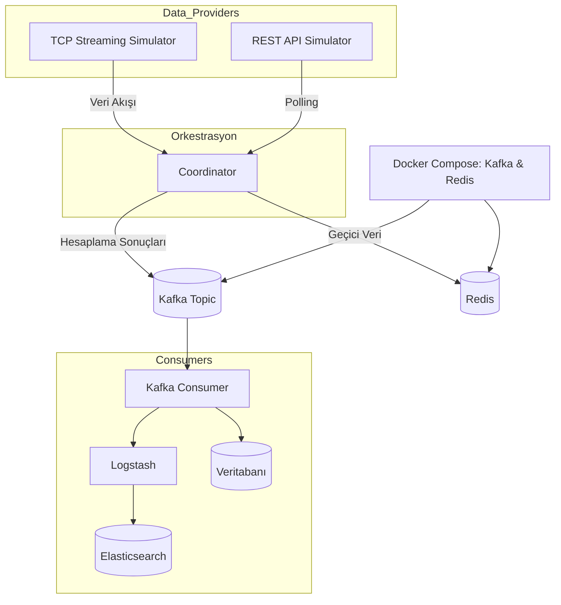

# Proje Mimarisi

Bu doküman, Forex projesinin modüler mimarisini açıklar ve bileşenler arasındaki veri akışını görselleştirir.

## Modüller

- **common**: Ortak veri modelleri ve arayüzler.
- **platform-tcp (PF1)**: TCP Streaming Simulator; gerçek zamanlı döviz verisi sağlar.
- **platform-rest (PF2)**: REST API Simulator; periyodik polling ile döviz verisi alır.
- **coordinator**: DataProvider’ları yönetir, gelen verileri işler, statik ve dinamik hesaplamalar yapar.
- **kafka-consumer**: Kafka’dan gelen hesaplama sonuçlarını DB’ye yazar ve log indeksleme görevlerini yürütür.
- **logstash**: Log toplama ve Elasticsearch’e yönlendirme konfigürasyonu.
- **docker-compose.yml**: Kafka ve Redis servislerini ayağa kaldırır.

## Bileşenler Arası Veri Akışı

## Açıklamalar
Bu mimari sayesinde her bileşen bağımsız geliştirilip test edilebilir. `common` modülü, arayüz ve veri model standardizasyonu sağlar. `coordinator` modülü, veri sağlayıcılarından (PF1, PF2) gelen ham verileri alır, `CalculationService` ile hem statik hem de dinamik hesaplamalar yapar, sonuçları Kafka ve Redis’e yayınlar. `kafka-consumer` bileşeni ise sonuçları veritabanına yazar ve Logstash aracılığıyla Elasticsearch’e indekslenmesini sağlar.
